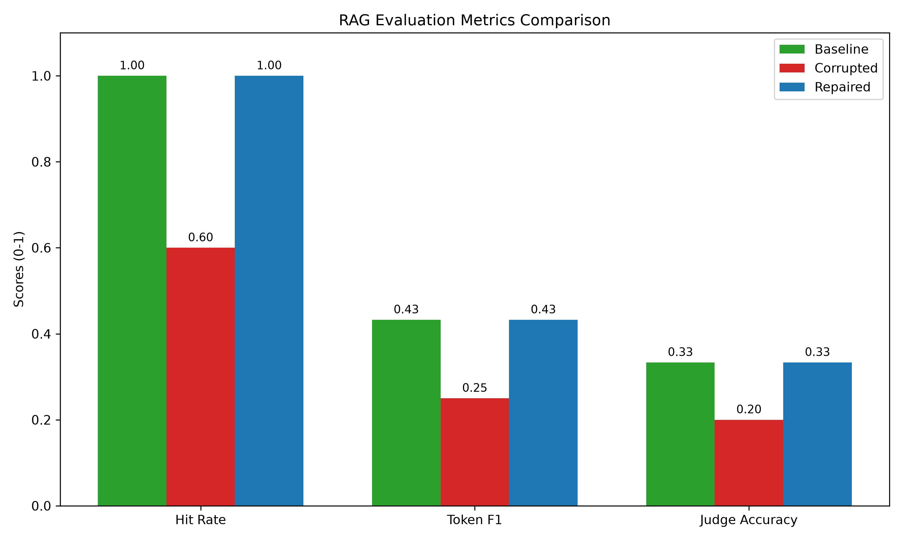

# Phase 2: Corruption and Repair Comparison Report

## Evaluation Metrics Comparison

| Metric | Baseline | Corrupted | Repaired |
|---|---|---|---|
| Hit Rate | 1.0000 | 0.6000 | 1.0000 |
| Token F1 | 0.4324 | 0.2501 | 0.4324 |
| Judge Accuracy | 0.3333 | 0.2000 | 0.3333 |
| Mean Judge Score | 2.3333 | 1.8000 | 2.3333 |

## Phân tích tác động (Root Cause Analysis)
- **Sự cố:** Dữ liệu bị lỗi đã làm Hit Rate giảm **40.0%** (từ 1.0000 xuống 0.6000).
- **Chất lượng:** Điểm đánh giá (Judge Score) của LLM cũng giảm **0.5333** điểm.
- **Phát hiện:** Hệ thống Observability đã bắt thành công các lỗi: 1 short summaries, 1 duplicates, và 1 stale rows.
- **Khôi phục:** Nhờ cơ chế Repair từ raw data, hệ thống đã khôi phục Hit Rate về lại 1.0000 và vượt qua mọi Quality/Freshness checks.

## Quality & Freshness (Corrupted)
- Quality Passed: False (Short summaries: 1, Empty titles: 0, Duplicates: 1)
- Is Fresh: False (Stale rows: 1)

## Quality & Freshness (Repaired)
- Quality Passed: True (Short summaries: 0, Empty titles: 0, Duplicates: 0)
- Is Fresh: True (Stale rows: 0)
